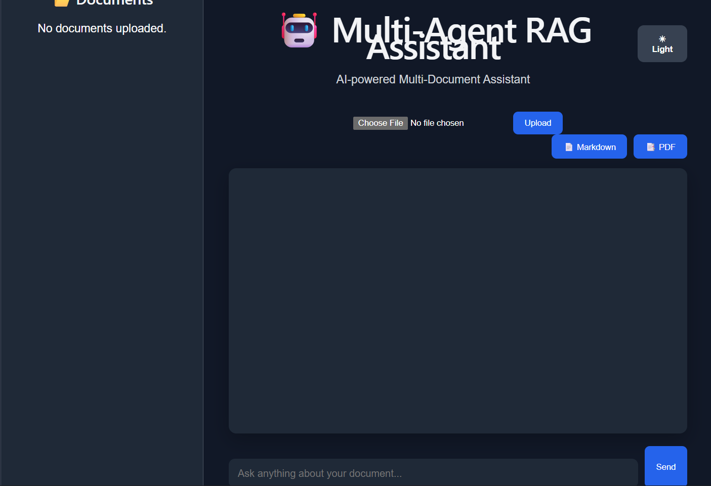
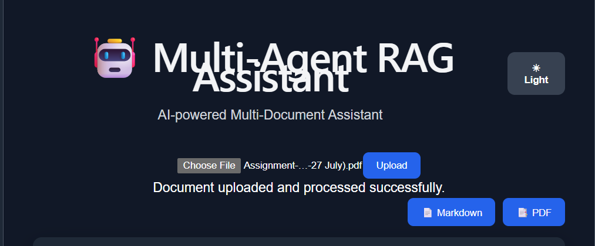
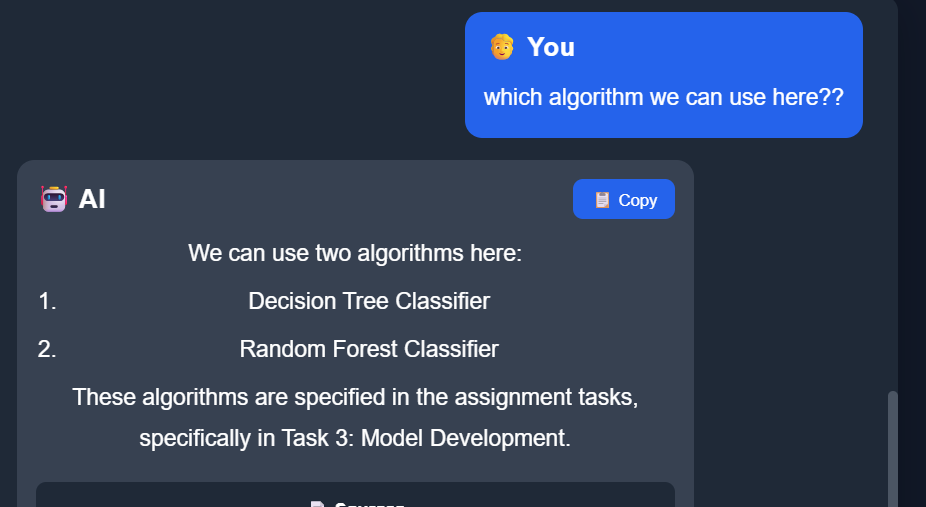

# 🤖 Multi-Agent RAG Assistant

> AI-powered **Multi-Agent Retrieval-Augmented Generation (RAG)**
> Assistant built using **React, FastAPI, LangGraph, Groq, FastEmbed,
> and Qdrant** for intelligent document question answering.

## 🌐 Live Demo

  Service       Link
  ------------- ------------------------------------------------------------
  Frontend      https://multi-agent-rag-assistant.vercel.app
  Backend API   https://multi-agent-rag-assistant-v2.onrender.com
  API Docs      https://multi-agent-rag-assistant-v2.onrender.com/docs
  GitHub        https://github.com/ayush-cpu-art/multi-agent-rag-assistant

------------------------------------------------------------------------

## 📖 Overview

The **Multi-Agent RAG Assistant** is an AI-powered document
question-answering system using React, FastAPI, LangGraph, FastEmbed,
Qdrant, and Groq.

## ✨ Features

-   Upload PDF, DOCX and TXT documents
-   Multi-Agent Workflow using LangGraph
-   FastEmbed Embeddings
-   Qdrant Vector Database
-   Semantic Search
-   Groq LLM Integration
-   Markdown & PDF Export
-   Light/Dark Theme
-   Delete Uploaded Documents

## 🛠 Tech Stack

-   React + Vite
-   FastAPI
-   LangGraph
-   Groq
-   FastEmbed (BAAI/bge-small-en-v1.5)
-   Qdrant

## 📸 Screenshots

### Home



### Upload



### Chat



## 🚀 Local Setup

``` bash
git clone https://github.com/ayush-cpu-art/multi-agent-rag-assistant.git
cd multi-agent-rag-assistant
```

## 👨‍💻 Author

**Ayush Dev**

https://github.com/ayush-cpu-art
